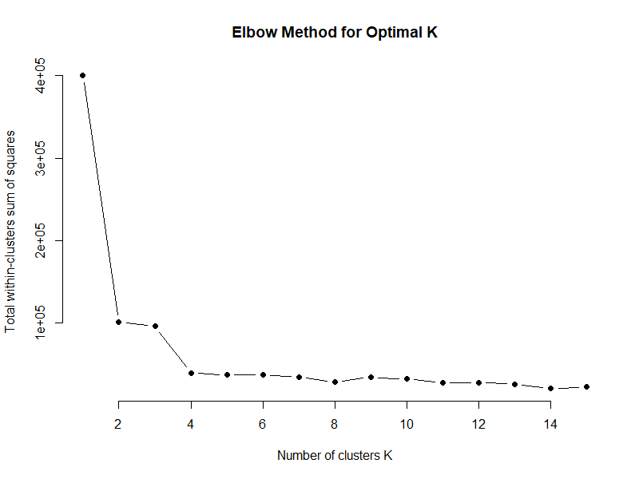

# Customer Segmentation Using K-Means Clustering

## Project Overview
This project applies **k-means clustering** in R to segment bank customers based on their demographic and financial characteristics.  
The goal is to identify distinct customer groups to support targeted marketing strategies for a credit card campaign.

## Business Context
The marketing team of **ABC Bank** is running a credit card campaign for existing customers.  
To improve campaign effectiveness, the team aims to understand customer segments based on:
- Age
- Monthly income
- Minimum and maximum account balances
- Length of relationship with the bank

## Objectives
1. Segment customers into distinct groups using clustering techniques  
2. Profile each customer segment based on key financial and demographic attributes  
3. Provide business-oriented interpretations of customer clusters  

## Dataset
The dataset (`Customer_data.csv`) is included in the repository and contains customer-level information.

### Dataset Description
Key variables used in the analysis:
- `age` — customer age  
- `MonthlyIncome` — monthly income  
- `MinBal` — minimum account balance  
- `MaxBal` — maximum account balance  
- `Age.with.Bank` — years of association with the bank  

The following variables were excluded from clustering:
- `Cust_Id`
- `City`

## Analysis Workflow
1. Data import and validation  
2. Data preprocessing and feature scaling  
3. K-means clustering with predefined number of clusters  
4. Cluster assignment and size evaluation  
5. Cluster profiling using mean values of original variables  
6. Determination of optimal number of clusters using the Elbow Method  

## Methods and Techniques
- Data preprocessing and scaling
- K-means clustering
- Cluster profiling
- Elbow method (Within-Cluster Sum of Squares)
- Data visualization

## Key Findings
- Customers were segmented into **three distinct clusters**  
- One cluster represents **high-income, high-balance, long-tenure customers**, indicating a premium segment  
- Another cluster consists of **younger customers with lower income and balances**, representing early-stage banking relationships  
- A third cluster includes **middle-aged customers with stable income and moderate balances**  

These segments can be used to design **targeted marketing strategies** for credit card offerings.

## Visualization

## Tools and Skills
- R
- K-means clustering
- Customer segmentation
- Feature scaling
- Data visualization
- Marketing analytics

## How to Run the Project
1. Clone the repository  
2. Open the R script  
3. Ensure the dataset (`Customer_data.csv`) is located in the root directory  
4. Run the script sequentially  

## Notes
This project was completed for educational purposes and demonstrates the application of unsupervised learning techniques for customer segmentation in a banking context.
